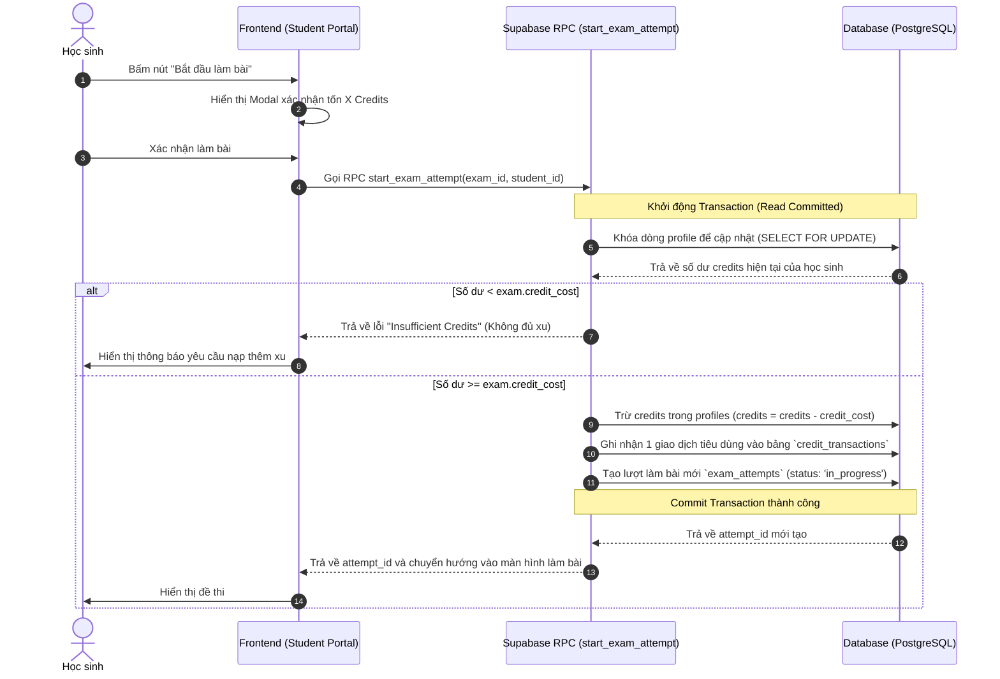
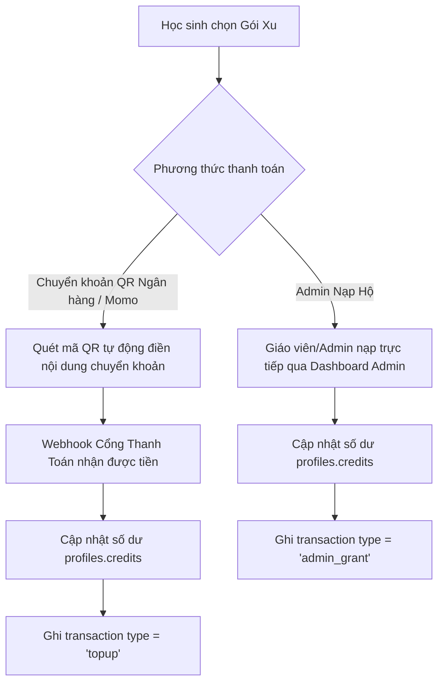

# 🪙 NGHIÊN CỨU NGHIỆP VỤ: HỆ THỐNG TIỀN TỆ (CREDIT/POINT SYSTEM)

Tài liệu này nghiên cứu, thiết kế và đề xuất giải pháp nghiệp vụ cho tính năng **Credit/Point (Tiền xu/Điểm)** trong ứng dụng **Smart Quiz**. Hệ thống này giúp thương mại hóa ứng dụng (Monetization), thu phí học sinh khi làm đề thi, đồng thời tích hợp cơ chế gamification (thưởng điểm) để tăng tương tác.

---

## 1. 🎯 Mục Tiêu Nghiệp Vụ (Business Goals)

1. **Thương mại hóa (Monetization)**: Biến các đề thi chất lượng cao thành nội dung trả phí. Học sinh phải mua Credit bằng tiền thật để mở khóa hoặc làm bài.
2. **Kiểm soát truy cập (Access Control)**: Giới hạn lượt làm bài thi dựa trên số dư Credit của học sinh.
3. **Gamification & Giữ chân người dùng**: Thưởng Credit cho học sinh khi đạt điểm cao (ví dụ: làm bài được 10/10 thưởng 2 Credits) hoặc điểm danh hàng ngày.
4. **Minh bạch tài chính (Auditing)**: Lưu trữ lịch sử giao dịch rõ ràng để đối soát và giải quyết khiếu nại của phụ huynh/học sinh.

---

## 2. 🧩 Các Khái Niệm Cốt Lõi (Core Entities)

| Khái niệm | Giải nghĩa nghiệp vụ |
| :--- | :--- |
| **Credit Balance** | Số dư xu hiện tại trong ví của học sinh. Được lưu trực tiếp trong hồ sơ người dùng (`profiles.credits`). |
| **Exam Cost** | Số xu cần trả để làm một đề thi (`exams.credit_cost`). Đề thi có thể miễn phí (0 xu) hoặc trả phí (> 0 xu). |
| **Transaction Ledger** | Nhật ký biến động số dư. Mỗi lần nạp xu, trừ xu làm bài, thưởng xu, hoặc hoàn xu đều sinh ra 1 transaction để đối soát. |
| **Retake Policy** | Chính sách làm lại: Mua một lần làm mãi mãi (Free Retake) hay mỗi lần bấm làm bài là một lần trừ xu (Pay-per-attempt). |

---

## 3. 🔄 Các Luồng Nghiệp Vụ Chi Tiết (Core Workflows)

### Luồng A: Khởi tạo bài thi & Khấu trừ Credit (Exam Purchase & Start Attempt)
Luồng này tích hợp trực tiếp vào hàm RPC `start_exam_attempt` để đảm bảo tính nguyên tử (atomic), chống tình trạng race condition (học sinh bấm liên tiếp để lách luật khi số dư bằng 0).



> [!IMPORTANT]
> **Chính sách làm lại (Retake Policy) khuyến nghị:**
> *   Nếu đề thi đã có lượt làm bài `in_progress` trước đó (chưa nộp): **Không tính phí lần nữa**, cho phép học sinh tiếp tục làm bài cũ (đã có sẵn trong logic RPC hiện tại).
> *   Nếu đề thi đã được nộp (`completed`): Có 2 hướng cấu hình:
>     1. **Mua 1 lần - Sở hữu mãi mãi (Unlock Once)**: Kiểm tra xem học sinh đã từng có lượt làm bài `completed` cho đề này chưa. Nếu đã từng làm, lần tiếp theo sẽ tốn 0 xu.
>     2. **Trả phí theo lượt (Pay-per-attempt)**: Mỗi lượt làm bài mới đều trừ xu để tránh học sinh spam làm đi làm lại tốn tài nguyên hệ thống.
>     *👉 Đề xuất: Thêm cột `allow_free_retake` (boolean) trong bảng `exams` để Giáo viên tự chọn cấu hình cho đề thi.*

---

### Luồng B: Nạp Credit (Credit Top-up)
Để hỗ trợ học sinh có xu làm bài, cần xây dựng cơ chế nạp tiền:



Các Gói Xu Đề Xuất (Ví dụ):
*   **Gói Nhập Môn**: 20,000 VND $\rightarrow$ 25 Credits (Làm được ~5 đề thi tiêu chuẩn)
*   **Gói Học Đường**: 50,000 VND $\rightarrow$ 70 Credits *(Khuyến mại +20% xu)*
*   **Gói Thủ Khoa**: 100,000 VND $\rightarrow$ 150 Credits *(Khuyến mại +50% xu)*

---

### Luồng C: Cơ Chế Thưởng (Gamification Reward)
Tăng tính tương tác bằng cách thưởng xu tự động khi nộp bài:
1. Khi học sinh nộp bài thi thành công và đạt kết quả cao (được tính toán trong RPC `submit_and_score_exam` ở database level).
2. Kiểm tra nếu điểm số đạt mốc thưởng (ví dụ: điểm $\ge 9.0$ được thưởng 2 Credits, đạt điểm tối đa $10/10$ thưởng 5 Credits).
3. Cộng xu trực tiếp vào ví học sinh và ghi nhận transaction với loại `'bonus'`.
4. Trả thông tin này về frontend để hiển thị pháo hoa ăn mừng và thông báo: *"Chúc mừng! Bạn được thưởng 5 Credits nhờ thành tích xuất sắc!"*

---

## 4. 🗄️ Thiết Kế Cơ Sở Dữ Liệu Chi Tiết (Database Schema Proposal)

Để hiện thực hóa nghiệp vụ này, chúng ta cần bổ sung cấu trúc database như sau:

### 1. Bổ sung vào bảng `profiles`
Thêm cột số dư credit:
*   `credits` (`int4`, mặc định `0`, thuộc tính `NOT NULL`): Số dư xu hiện tại. Ràng buộc kiểm tra: `CHECK (credits >= 0)`.

### 2. Bổ sung vào bảng `exams`
Thêm cấu hình chi phí và làm lại:
*   `credit_cost` (`int4`, mặc định `0`, thuộc tính `NOT NULL`): Số xu cần trả để làm bài. Ràng buộc: `CHECK (credit_cost >= 0)`.
*   `allow_free_retake` (`bool`, mặc định `true`, thuộc tính `NOT NULL`): Mua 1 lần làm lại miễn phí hay mỗi lần làm đều tốn xu.

### 3. Tạo mới bảng `credit_transactions` (Lịch sử giao dịch)
Lưu dấu vết dòng tiền để kiểm toán.

| Tên cột | Kiểu dữ liệu | Thuộc tính | Mô tả |
| :--- | :--- | :---: | :--- |
| `id` 🔑 | `uuid` | ✦ | Khóa chính, tự động tạo |
| `student_id` 🔗 | `uuid` | ✦ | Liên kết ngoại tới `profiles.id` (Học sinh thực hiện) |
| `amount` | `int4` | ✦ | Số xu thay đổi (Số dương là nạp/thưởng, Số âm là tiêu dùng) |
| `type` | `varchar` | ✦ | Loại giao dịch: `spend` (Làm bài), `topup` (Nạp xu), `bonus` (Thưởng điểm), `refund` (Hoàn xu), `admin_grant` (Admin cấp) |
| `exam_id` 🔗 | `text` | ◇ | Liên kết ngoại tới `exams.id` (nếu giao dịch liên quan đến đề thi) |
| `description` | `text` | ◇ | Mô tả chi tiết giao dịch (ví dụ: "Thanh toán làm bài thi giữa kỳ Toán 10") |
| `created_at` | `timestamptz` | ✦ | Thời gian giao dịch phát sinh |

---

## 5. 🛠️ Thiết Kế SQL Chi Tiết (Migration & RPC)

Dưới đây là mã SQL mẫu dùng để tạo các bảng mới và cập nhật RPC `start_exam_attempt` nhằm kiểm soát ví tiền atomically.

```sql
-- 1. Cập nhật bảng profiles và exams
ALTER TABLE profiles ADD COLUMN IF NOT EXISTS credits INT4 NOT NULL DEFAULT 0 CONSTRAINT check_credits_non_negative CHECK (credits >= 0);
ALTER TABLE exams ADD COLUMN IF NOT EXISTS credit_cost INT4 NOT NULL DEFAULT 0 CONSTRAINT check_cost_non_negative CHECK (credit_cost >= 0);
ALTER TABLE exams ADD COLUMN IF NOT EXISTS allow_free_retake BOOLEAN NOT NULL DEFAULT TRUE;

-- 2. Tạo bảng nhật ký giao dịch
CREATE TABLE IF NOT EXISTS credit_transactions (
    id UUID PRIMARY KEY DEFAULT gen_random_uuid(),
    student_id UUID NOT NULL REFERENCES profiles(id) ON DELETE CASCADE,
    amount INT4 NOT NULL,
    type VARCHAR(50) NOT NULL CHECK (type IN ('spend', 'topup', 'bonus', 'refund', 'admin_grant')),
    exam_id TEXT REFERENCES exams(id) ON DELETE SET NULL,
    description TEXT,
    created_at TIMESTAMPTZ NOT NULL DEFAULT NOW()
);

-- 3. Bật RLS cho bảng giao dịch
ALTER TABLE credit_transactions ENABLE ROW LEVEL SECURITY;
CREATE POLICY "Học sinh chỉ xem giao dịch của mình" ON credit_transactions
    FOR SELECT TO authenticated USING (auth.uid() = student_id);

-- 4. Viết lại hàm start_exam_attempt hỗ trợ Credit
CREATE OR REPLACE FUNCTION start_exam_attempt(
    p_exam_id TEXT,
    p_student_id UUID
)
RETURNS UUID AS $$
DECLARE
    v_attempt_id UUID;
    v_credit_cost INT;
    v_allow_free_retake BOOLEAN;
    v_current_credits INT;
    v_has_completed_attempt BOOLEAN;
BEGIN
    -- A. Kiểm tra xem học sinh đã có lượt làm bài nào ĐANG IN-PROGRESS hay chưa
    SELECT id INTO v_attempt_id
    FROM exam_attempts
    WHERE exam_id = p_exam_id AND student_id = p_student_id AND status = 'in_progress'
    LIMIT 1;

    -- Nếu đã có lượt đang làm, trả về luôn (không tốn thêm xu)
    IF v_attempt_id IS NOT NULL THEN
        RETURN v_attempt_id;
    END IF;

    -- B. Lấy thông tin chi phí của đề thi và cấu hình retake
    SELECT credit_cost, allow_free_retake INTO v_credit_cost, v_allow_free_retake
    FROM exams
    WHERE id = p_exam_id;

    IF NOT FOUND THEN
        RAISE EXCEPTION 'Đề thi không tồn tại.';
    END IF;

    -- C. Nếu đề thi có phí (> 0 xu)
    IF v_credit_cost > 0 THEN
        -- Kiểm tra xem học sinh đã từng làm bài này hoàn chỉnh chưa
        SELECT EXISTS(
            SELECT 1 FROM exam_attempts 
            WHERE exam_id = p_exam_id AND student_id = p_student_id AND status = 'completed'
        ) INTO v_has_completed_attempt;

        -- Nếu cho phép làm lại miễn phí VÀ đã từng làm hoàn chỉnh -> Miễn phí
        IF v_allow_free_retake AND v_has_completed_attempt THEN
            v_credit_cost := 0;
        END IF;
    END IF;

    -- D. Thực hiện trừ xu nếu phí > 0
    IF v_credit_cost > 0 THEN
        -- Khóa dòng dữ liệu profile của học sinh để tránh race condition
        SELECT credits INTO v_current_credits
        FROM profiles
        WHERE id = p_student_id
        FOR UPDATE;

        IF v_current_credits < v_credit_cost THEN
            RAISE EXCEPTION 'Số dư không đủ. Bạn cần % xu nhưng chỉ có % xu.', v_credit_cost, v_current_credits;
        END IF;

        -- Trừ xu học sinh
        UPDATE profiles
        SET credits = credits - v_credit_cost
        WHERE id = p_student_id;

        -- Ghi nhật ký giao dịch tiêu dùng xu
        INSERT INTO credit_transactions (student_id, amount, type, exam_id, description)
        VALUES (
            p_student_id, 
            -v_credit_cost, 
            'spend', 
            p_exam_id, 
            'Trừ phí tham gia làm đề thi: ' || (SELECT title FROM exams WHERE id = p_exam_id)
        );
    END IF;

    -- E. Khởi tạo bản ghi lượt làm bài thi mới
    INSERT INTO exam_attempts (
        id,
        exam_id,
        student_id,
        started_at,
        status,
        created_at
    )
    VALUES (
        gen_random_uuid(),
        p_exam_id,
        p_student_id,
        NOW(),
        'in_progress',
        NOW()
    )
    RETURNING id INTO v_attempt_id;

    RETURN v_attempt_id;
END;
$$ LANGUAGE plpgsql SECURITY DEFINER;
```

---

## 6. 🎨 Thiết Kế Trải Nghiệm Giao Diện Người Dùng (UI/UX Mockup Design)

Để hệ thống trông thật **xịn sò, premium và kích thích học sinh nạp tiền**, giao diện cần sử dụng các yếu tố thị giác bắt mắt (glowing coins, glassmorphism, và micro-interactions).

### Màn hình Học sinh (Student Dashboard)
1.  **Thanh Tiêu Đề (Navbar)**:
    *   Hiển thị widget số dư xu: Một chiếc huy hiệu kính mờ (glassmorphism) với biểu tượng đồng xu vàng xoay nhẹ khi hover, kèm theo hiệu ứng đổ bóng màu vàng neon: `🪙 125 Xu`.
    *   Bên cạnh có nút `[+] Nạp xu` mở nhanh cửa sổ mua gói.
2.  **Danh sách Đề thi (Exam Cards)**:
    *   Mỗi thẻ đề thi có một góc hiển thị nhãn chi phí:
        *   Nếu miễn phí: Tag màu xanh lục ngọc lục bảo phát sáng `Miễn phí`.
        *   Nếu có phí: Tag màu cam lửa hổ phách `🪙 5 Xu` hoặc `🪙 10 Xu`.
    *   Khi rê chuột vào đề thi có phí, nút làm bài sẽ thay đổi trạng thái và hiển thị tooltip: *"Bắt đầu làm bài thi này sẽ tiêu phí 5 xu từ tài khoản của bạn."*
3.  **Hộp thoại xác nhận làm bài (Pre-exam Modal)**:
    *   Khi bấm vào đề thi, hiển thị pop-up thông tin đề thi kèm cảnh báo trừ xu rất tinh tế:
        *   "Bạn đang chuẩn bị tham gia: Đề kiểm tra Toán 10 học kỳ 2"
        *   "Thời gian: 45 phút | Số câu hỏi: 25 câu"
        *   "Chi phí: **10 Xu** (Số dư của bạn: **125 Xu**)"
        *   Nút xác nhận thiết kế gradient bắt mắt: `Đồng ý & Trừ 10 Xu để làm bài`.

### Màn hình Quản trị viên / Giáo viên (Admin Dashboard)
1.  **Quản lý Đề thi (Exam Management)**:
    *   Trong form tạo đề thi, bổ sung thêm 2 trường cấu hình:
        *   `Chi phí làm đề (Xu)`: Ô nhập số tự nhiên.
        *   `Cho phép làm lại miễn phí`: Toggle switch bật tắt.
2.  **Quản lý Học sinh (User Management)**:
    *   Bảng danh sách học sinh hiển thị thêm cột **Số dư Xu**.
    *   Hỗ trợ nút hành động nhanh: **"Nạp xu hộ"** hoặc **"Thu hồi xu"** cho trường hợp chuyển khoản ngân hàng thủ công hoặc cộng điểm thưởng bằng tay.

---

## 🚀 Kế Hoạch Triển Khai (Next Steps)

1.  **Bước 1**: Nhận phản hồi của anh về bản phân tích nghiệp vụ này (có cần sửa đổi luật trừ tiền, cách tính phí làm lại hay gói nạp xu không).
2.  **Bước 2**: Thực thi file Migration SQL trong cơ sở dữ liệu Supabase để cập nhật cấu trúc bảng và cập nhật các hàm RPC (`start_exam_attempt`, `submit_and_score_exam`).
3.  **Bước 4**: Cập nhật Context (`AuthContext.tsx`) của Student App để lưu trữ và quản lý state `credits` của học sinh thời gian thực.
4.  **Bước 5**: Thiết kế giao diện hiển thị Credit trong Navbar học sinh, các nhãn (badge) chi phí xu trên các thẻ đề thi tại Dashboard.
5.  **Bước 6**: Tích hợp Modal nạp tiền / nạp xu cực đẹp với các gói thanh toán giả lập QR chuyển khoản, giúp học sinh có thể tự cộng xu test thử.
6.  **Bước 7**: Bổ sung cấu hình phí làm bài (credit_cost) và quản lý số dư của học sinh vào dashboard của Giáo viên (`smart-quiz-app`).
